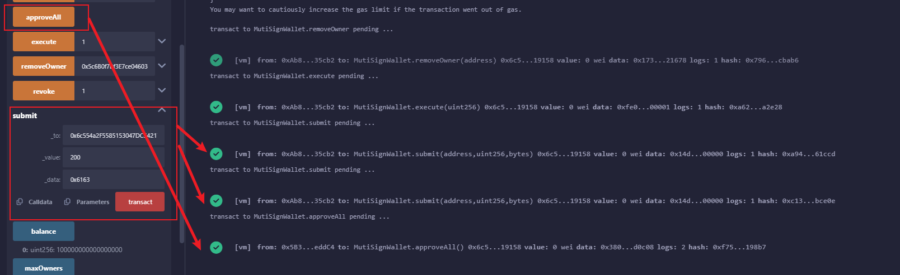

## 项目介绍
暂不支持并发加载合约
### 事件定义
* Deposit 事件：当以太币存⼊钱包时触发
* Submit 事件：当提交交易时触发
* Approve 事件：当交易被批准时触发
* Execute 事件：当交易被执⾏时触发
* Revoke 事件：当批准被撤销时触发
### 状态变量
* owners ：存储所有者地址的数组
* isOwner ：检查某地址是否为所有者的映射
* threshold ：执⾏交易所需的最少批准数，要求半数以上批准
* transactions ：存储所有交易的数组
* approve ：存储每个交易被每个所有者批准情况的映射
* maxOwners: 钱包共有人的最大数量
### 结构体定义
* Transaction 结构体：包含交易⽬标地址、发送⾦额、交易数据和执⾏状态
### 构造函数
* 初始化所有者数组和所需的批准数
* 确保所有者地址有效且唯⼀
* 设置状态变量
### 以太币接收功能
* receive 函数：接收以太币并触发 Deposit 事件
### 交易提交
* submit 函数：提交新交易
* 使⽤ onlyOwner 修饰符限制只有所有者可以调⽤
### 交易批准
* approve 函数：批准交易
* 使⽤ txExists 、 notApproved 和 notExecuted 修饰符确保交易存在、未被批准且未
被执⾏
### 交易执⾏
* execute 函数：执⾏已批准的交易
* 确认批准数量⾜够
* 使⽤低级调⽤执⾏交易
* 更新交易执⾏状态
### 批准撤销
* revoke 函数：撤销已批准的交易
* 确认交易存在、未被执⾏且已被当前所有者批准

## remix测试记录
### 1. 部署合约
准备 ["0x5B38Da6a701c568545dCfcB03FcB875f56beddC4", "0xAb8483F64d9C6d1EcF9b849Ae677dD3315835cb2", "0x4B20993Bc481177ec7E8f571ceCaE8A9e22C02db"] 3个账户，输入该钱包最多允许10个用户持有

接收以太币，触发 Transact 事件

触发2笔交易，分别向 0x617F2E2fD72FD9D5503197092aC168c91465E7f2 转账100wei和1000wei，并提交

直接触发 execute 函数，因为只有1个账户，所以交易无法被执⾏

### 2. 批准交易
改变调用账户为 0xAb8483F64d9C6d1EcF9b849Ae677dD3315835cb2，批准交易。再次触发 execute 函数，因为批准数量达到阈值，交易被执⾏

创建2个交易，一个交易转账100wei，一个交易转账1000wei，一次性批准所有交易。再次触发 execute 函数，交易依次被执⾏，最后账户减少1100wei

### 3. 撤销批准
继续使用账户 0xAb8483F64d9C6d1EcF9b849Ae677dD3315835cb2，批准交易再撤销批准。再次触发 execute 函数，因为交易已被撤销，所以无法被执⾏

### 4. 账户新增和移除共有者
新增 0x5c6B0f7Bf3E7ce046039Bd8FABdfD3f9F5021678 账户为钱包的共有者。再次触发 execute 函数，因为批准数量未达到阈值，交易无法被执行

移除 0x5c6B0f7Bf3E7ce046039Bd8FABdfD3f9F5021678 共有者，再次触发 execute 函数，交易成功执行

